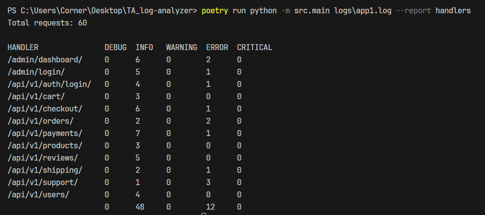
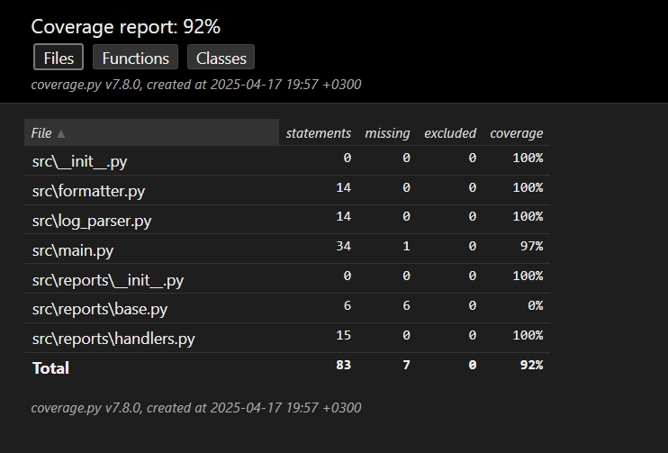

# Тестовое задание Log Analyzer


`TA_log-analyzer` — это консольное приложение (CLI) для анализа логов Django-приложений и формирования отчётов. Оно обрабатывает несколько лог-файлов параллельно, объединяет статистику и выводит отформатированный отчёт в консоль. На данный момент поддерживается один тип отчёта (`handlers`), но архитектура приложения позволяет легко добавлять новые типы отчётов.

Проект полностью соответствует требованиям технического задания (ТЗ), включая:

- Обработку нескольких лог-файлов с параллельным выполнением.
- Поддержку отчёта `handlers` для статистики по API-ручкам с разбивкой по уровням логирования.
- Проверку существования входных файлов и корректности имени отчёта.
- Использование только стандартной библиотеки Python (кроме тестирования).
- Высокое покрытие тестами (92%) с использованием `pytest`.
- Наличие аннотаций типов и соответствие стандартам стиля кода.
- Поддержку обработки больших лог-файлов (несколько гигабайт).

## Структура проекта

```
TA_log-analyzer/
├── examples/                   # Примеры вывода
│   └── working_report.png      # Скриншот примера отчёта
├── htmlcov/                    # Отчёты о покрытии тестами (генерируются)
├── logs/                       # Примерные лог-файлы
│   ├── app1.log
│   └── app2.log
├── src/                        # Исходный код
│   ├── formatter.py            # Логика форматирования отчётов
│   ├── log_parser.py           # Логика парсинга логов
│   ├── main.py                 # Точка входа CLI
│   └── reports/                # Логика генерации отчётов
│       ├── base.py             # Базовый класс для отчётов
│       └── handlers.py         # Реализация отчёта handlers
├── tests/                      # Тесты
│   ├── fixtures/               # Тестовые лог-файлы
│   ├── test_cli.py             # Тесты CLI
│   ├── test_parser.py          # Тесты парсера логов
│   └── test_report.py          # Тесты генерации отчётов
├── makefile                    # Автоматизация установки, тестов и линтинга
├── poetry.lock                 # Файл блокировки зависимостей
├── pyproject.toml              # Конфигурация проекта и зависимостей
└── README.md                   # Документация проекта
```

## Возможности

### Функциональные требования

- **Анализ нескольких лог-файлов**: Обрабатывает один или несколько лог-файлов Django, объединяя статистику.
- **Отчёт `handlers`**: Формирует отчёт, подсчитывающий количество запросов к API-ручкам по уровням логирования (`DEBUG`, `INFO`, `WARNING`, `ERROR`, `CRITICAL`), с сортировкой ручек в алфавитном порядке.
- **Проверка входных данных**: Проверяет существование указанных файлов и корректность имени отчёта.
- **Вывод отчёта**: Выводит отформатированный отчёт в консоль, включая общее количество запросов.

### Нефункциональные требования

- **Стандартная библиотека**: Используется только стандартная библиотека Python для основного кода (кроме тестов).
- **Параллельная обработка**: Лог-файлы обрабатываются параллельно с использованием `ThreadPoolExecutor` для эффективной работы на многоядерных системах.
- **Расширяемая архитектура**: Модуль `reports` позволяет добавлять новые отчёты с минимальными изменениями в существующем коде.
- **Тестирование**: Код покрыт тестами на 92% (по `pytest-cov`), с использованием `pytest` и дополнительных библиотек для тестирования.
- **Аннотации типов**: Все функции и методы содержат аннотации типов для улучшения читаемости и проверки.
- **Стиль кода**: Код соответствует стандартам стиля, проверяется с помощью `flake8`.

## Установка

1. **Клонируйте репозиторий**:

   ```bash
   git clone https://github.com/Corner324/TA_log-analyzer.git
   cd ta-log-analyzer
   ```
2. **Установите Poetry** (если ещё не установлено):

   ```bash
   pip install poetry
   ```
3. **Установите зависимости**:

   ```bash
   make install
   ```

   Эта команда использует `poetry install` для установки всех зависимостей, указанных в `pyproject.toml`.
4. **Убедитесь, что `make` установлен**:

   - На Windows используйте WSL, MinGW или Cygwin.
   - Проверьте: `make --version`.
   - Если `make` недоступен, замените команды `make` на соответствующие команды из `Makefile` (например, `poetry install` вместо `make install`).

## Использование

### Формирование отчёта

Запустите приложение, указав пути к лог-файлам и тип отчёта:

```bash
poetry run python src/main.py logs/app1.log logs/app2.log --report handlers
```

**Пример вывода**:

```
Total requests: 1000

HANDLER                DEBUG   INFO    WARNING ERROR   CRITICAL
/admin/dashboard/      20      72      19      14      18
/api/v1/auth/login/    23      78      14      15      18
/api/v1/orders/        26      77      12      19      22
/api/v1/payments/      26      69      14      18      15
/api/v1/products/      23      70      11      18      18
/api/v1/shipping/      60      128     26      32      25
                       178     494     96      116     116
```

Скриншот отчета:



### Проверка входных данных

- Если указан несуществующий файл, приложение выведет ошибку:
  ```
  Error: File nonexistent.log does not exist
  ```
- Если указан неверный тип отчёта, приложение выведет ошибку:
  ```
  Error: Invalid report name. Only 'handlers' is supported
  ```

## Тестирование и линтинг

Проект включает тесты (`pytest`) с покрытием 92% и проверку стиля кода (`flake8`). Все задачи автоматизированы через `Makefile`.

Уровень покрытия:



### Запуск тестов

```bash
make test
```

Эта команда запускает тесты с покрытием:

```bash
poetry run pytest --cov=src --cov-report=html
```

Отчёт о покрытии сохраняется в `htmlcov/`.

### Проверка стиля кода

```bash
make lint
```

Эта команда проверяет код в директориях `src` и `tests` с помощью `flake8`:

```bash
poetry run flake8 src tests --max-line-length=120 --extend-ignore=E203
```

### Полная проверка

```bash
make all
```

Выполняет установку зависимостей, линтинг и тесты.

### Очистка

```bash
make clean
```

Удаляет сгенерированные файлы (`htmlcov`, `.pytest_cache`).

## Добавление нового отчёта

Архитектура приложения позволяет легко добавлять новые отчёты. Для этого:

1. **Создайте новый класс отчёта**:

   - В директории `src/reports/` добавьте новый файл, например, `new_report.py`.
   - Создайте класс, наследующийся от `BaseReport` (из `src/reports/base.py`):
     ```python
     from typing import Dict
     from .base import BaseReport

     class NewReport(BaseReport):
         def generate(self, data: Dict[str, Dict[str, int]]) -> str:
             # Логика формирования нового отчёта
             pass
     ```
2. **Обновите `main.py`**:

   - В `main.py` добавьте поддержку нового отчёта в проверке аргумента `--report`:
     ```python
     if args.report == "handlers":
         report = HandlersReport()
     elif args.report == "new_report":
         report = NewReport()
     else:
         print("Error: Invalid report name.", file=sys.stderr)
         sys.exit(1)
     ```
3. **Добавьте тесты**:

   - В `tests/test_report.py` добавьте тесты для нового отчёта, аналогичные тестам для `HandlersReport`.

Такой подход минимизирует изменения в существующем коде, так как новый отчёт изолирован в отдельном классе.

## Требования к окружению

- **Python**: 3.12+
- **Poetry**: Для управления зависимостями.
- **Make**: Для выполнения команд `Makefile` (на Windows используйте WSL, MinGW или Cygwin).
- **Зависимости**:
  - `pytest`, `pytest-cov` (для тестирования).
  - `flake8` (для линтинга).
